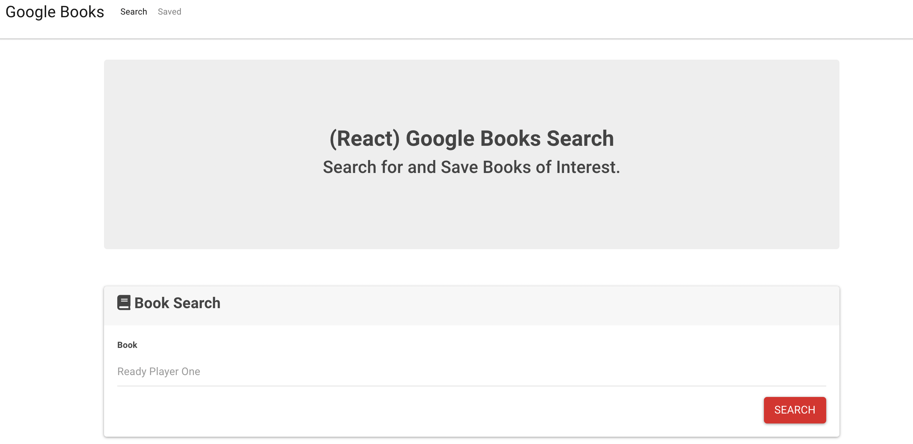

# Google Book Search

## Description

This is a web application that allows the user to search through Google Books, and save any books they like into a Mongo database.

## Link

Heroku Deployed application:
https://guarded-coast-99857.herokuapp.com/

## Usage

When you navigate to the page, you will be able to search for any book, and the results will be displayed. You can choose to save any book that is displayed into the database. If you click 'Saved' in the navbar, you will be brought to a list of all books within the database. On the 'Saved' page, you can link to the full Google Books page for the book, or delete it from the database.

## Credits

This homework assignment was a walk-through with the instructor, Bryan Swarthout.

http://www.uclaextension.edu

Deployed the application on Heroku.

https://www.Heroku.com

## Questions

For any questions, I, DJ Hersh, can be contacted via email at DanielJHersh@gmail.com

My GitHub profile is located at https://github.com/DJ620

## License

MIT License

Copyright (c) [2020] [DJ Hersh]

Permission is hereby granted, free of charge, to any person obtaining a copy
of this software and associated documentation files (the "Software"), to deal
in the Software without restriction, including without limitation the rights
to use, copy, modify, merge, publish, distribute, sublicense, and/or sell
copies of the Software, and to permit persons to whom the Software is
furnished to do so, subject to the following conditions:

The above copyright notice and this permission notice shall be included in all
copies or substantial portions of the Software.

THE SOFTWARE IS PROVIDED "AS IS", WITHOUT WARRANTY OF ANY KIND, EXPRESS OR
IMPLIED, INCLUDING BUT NOT LIMITED TO THE WARRANTIES OF MERCHANTABILITY,
FITNESS FOR A PARTICULAR PURPOSE AND NONINFRINGEMENT. IN NO EVENT SHALL THE
AUTHORS OR COPYRIGHT HOLDERS BE LIABLE FOR ANY CLAIM, DAMAGES OR OTHER
LIABILITY, WHETHER IN AN ACTION OF CONTRACT, TORT OR OTHERWISE, ARISING FROM,
OUT OF OR IN CONNECTION WITH THE SOFTWARE OR THE USE OR OTHER DEALINGS IN THE
SOFTWARE.